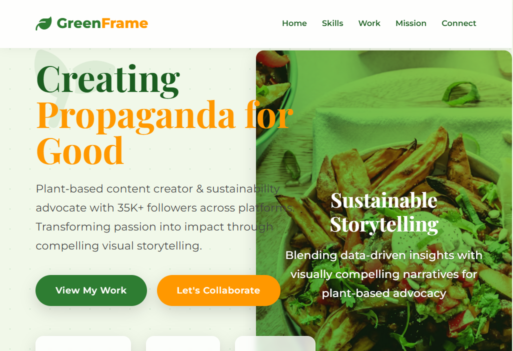

# 🌱 GreenFrame Creative Template


*A modern portfolio template for sustainability-focused content creators*

## 🚀 Live Demo
**[https://worldsocoled.github.io/GreenFrameTemplate/](https://worldsocoled.github.io/GreenFrameTemplate/)**

## ✨ Features

- **Eco-Conscious Design**  
  Green color palette with organic elements and nature-inspired visuals
  
- **Fully Responsive**  
  Mobile-first layout that works on all devices
  
- **Interactive Components**:
  - Animated skill cards
  - Portfolio hover effects
  - Smooth scrolling navigation
  - Dynamic statistics counter
  - 
- **6 Ready-to-Use Sections**:
  1. Hero with stats dashboard
  2. Skills showcase
  3. Portfolio gallery
  4. Mission statement
  5. Contact form
  6. Multi-column footer
  7. 
- **Performance Optimized**  
  Pure CSS/JS implementation (no frameworks)
- **Easy Customization**  
  CSS variables for color theming

## 🛠 Technologies Used

- **Frontend**:  
  
  
  
  
- **Design**:
  - Font Awesome Icons
  - Google Fonts (Montserrat & Playfair Display)
  - CSS Variables for theming
  - CSS Grid/Flexbox layout

## 🪴 How to Use

1. **Clone repository**:
   ```bash
   git clone https://github.com/worldsocoled/GreenFrameTemplate.git
   ```
   
2. **Customize content**:
   -Edit index.html with your personal information
   -Modify colors in :root CSS variables
   -Update images in portfolio section

3. **Deploy**:

   -Host on GitHub Pages (as shown in this repo)
   -Or deploy to any static hosting service

## **🎨 Customization Guide**:

**Change colors in CSS**:

```CSS
:root {
  --primary: #2e7d32;      /* Main green color */
  --primary-light: #4caf50; /* Light green */
  --secondary: #ff9800;    /* Accent orange */
  --light: #f1f8e9;        /* Background */
  --dark: #1b5e20;         /* Dark green */
  }
```
## 📜 **License**

**MIT License** - Free for personal and commercial use with attribution

## 🌍 **About the Creator**

**WorldSoColed Web Artistry**
Creating beautiful, purpose-driven web experiences

https://img.shields.io/github/stars/worldsocoled/GreenFrameTemplate?style=social

## **Key elements included**:

1. Professional header with emoji and descriptive tagline
2. Clear live demo link at the top
3. Feature list with emoji bullets
4. Technology badges using shields.io
5. Step-by-step usage instructions
6. Practical customization guide
7. License information
8. Creator attribution with GitHub link
9. Star encouragement badge
10. Visual hierarchy with section headers


